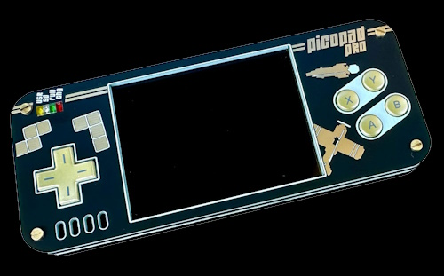

My programs and experiments for [Picopad](https://picopad.eu/cs/index.html) gaming console loader from [Panda381](https://github.com/Panda381/PicoLibSDK.git):

[Picopad](https://picopad.eu/cs/index.html) is an open-source gaming console that offers a unique opportunity for young tech enthusiasts. It comes as a kit, allowing children to learn soldering and electronics principles while assembling their own gaming console. Additionally, Picopad supports programming in C, CircuitPython and MicroPython, making it an ideal tool for learning programming skills. With external cards for various educational expansions, Picopad is also a perfect tool for developing STEM (Science, Technology, Engineering, Mathematics) skills.

---
> **GitHub:**&nbsp;&nbsp;&nbsp;&nbsp;&nbsp;&nbsp;&nbsp;[https://github.com/pajenicko/picopad](https://github.com/pajenicko/picopad)

> **www:**&nbsp;&nbsp;&nbsp;&nbsp;&nbsp;&nbsp;&nbsp;&nbsp;&nbsp;&nbsp;&nbsp;[https://picopad.eu/cs/index.html](https://picopad.eu/cs/index.html)

> **Buy:**&nbsp;&nbsp;&nbsp;&nbsp;&nbsp;&nbsp;&nbsp;&nbsp;&nbsp;&nbsp;&nbsp;&nbsp;&nbsp;[https://pajenicko.cz/picopad](https://pajenicko.cz/picopad)
---
&nbsp;
## Tools from [Tomas Vecera](https://github.com/tvecera/picopad-playground):

### **1. PyPicoPadImg Generator**

This Python program is designed to generate image arrays compatible with Picopad SDK. It takes an image file as input and 
creates a C array of pixel values, ready to be used in your Picopad SDK software. The program utilizes the 
Run-Length Encoding (RLE) compression technique to reduce the memory footprint of the images.

Please note that this software currently only tested on 8-bit PNG images using a color lookup table (palette).

The code of this generator is based on the original Picopad SDK source code.

- **[Link](tools/PyPicoPadImg)**

### **2. PyConvertLoaderImg**

PyConvertLoaderImg is a Python-based tool that is capable of converting images into 16-bit BMP images. This tool
specifically generates images that are compatible with the Picopad loader application.

The tool reads image files, provides some basic information about them, downsamples the images by reducing the bit depth
of each color channel, and saves the resulting image as a 16-bit BMP file.

- **[Link](tools/PyConvertLoaderImg)**

### **3. PyRaspPicoSnd**

PyRaspPicoSnd is a Python utility designed to convert audio files into a C++ array format suitable for the Picopad
SDK. The audio is processed to match a specific format: PCM, mono, 8-bit unsigned, with a sample rate of 22050Hz. This
ensures compatibility and optimal playback on the Picopad handheld devices. The tool requires `ffmpeg` for audio format
decoding.

The generated `.c` output contains the audio data in a compact C++ array format, ready for direct integration into
your Picopad SDK software projects.

- **[Link](tools/PyRaspPicoSnd)**

### **4. Picopad TFT Display emulator**

This project provides an emulator for the TFT display of Picopad handheld devices. It's designed to assist in the
prototyping and development of applications for Picopad handhelds. With this tool, you can easily prepare and test your
display code using the API of the Picopad SDK.

The code of this emulator is based on the original Picopad SDK source code.

- **[Link](tools/tft-emulator)**

