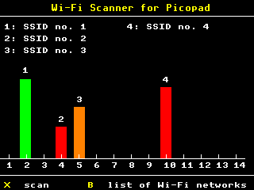
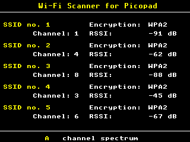

## A simple Wi-Fi scanner for the [Picopad](https://picopad.eu/en/) gaming console.

---

> <picture>
>   <source media="(prefers-color-scheme: light)" srcset="https://raw.githubusercontent.com/Mqxx/GitHub-Markdown/main/blockquotes/badge/light-theme/info.svg">
>   
> </picture> 
>
> The program is launched in the graphical version of the scanner. Use the X key to scan available Wi-Fi networks. In the graphical version of the scanner, the scan of Wi-Fi networks is not automatic, but only after pressing the X key.
>
> Press the B key to switch to the text list of Wi-Fi networks. In this mode, available Wi-Fi networks are scanned automatically after 3 seconds. Press the A key to switch back to graphics mode.
>
> In both versions of the scanner, pressing the Y key exits the program.
>
> This is a beta version and it's still in the testing phase. Therefore, all operations should be performed at your own risk. 

---

**Screenshots:**

&nbsp;&nbsp;&nbsp;&nbsp;&nbsp;&nbsp;&nbsp;&nbsp;&nbsp;&nbsp;&nbsp;&nbsp;&nbsp;&nbsp;&nbsp;&nbsp;&nbsp;&nbsp;&nbsp;&nbsp;
