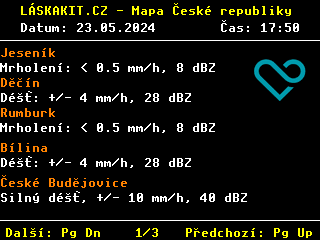

### A simple program for displaying the cities of the Czech Republic in which it rains for the [Picopad](https://picopad.eu/en/) gaming console.

---

> <picture>
>   <source media="(prefers-color-scheme: light)" srcset="https://raw.githubusercontent.com/Mqxx/GitHub-Markdown/main/blockquotes/badge/light-theme/info.svg">
>   
> </picture> 
>
> The program displays a list of cities in the Czech Republic where it is currently raining. The list contains the name of the regional city and information about the intensity of rain in the given area.
>
> **Source of information for the program:**
>
>> [JSON file](https://kloboukuv.cloud/radarmapa/?chcu=posledni_v2.json) from [Jakub Čížek](https://github.com/jakubcizek) (X: pesvklobouku)
>>
>> The JSON file is originally created for the interactive map of the Czech Republic from [laskakit.cz](https://www.laskakit.cz/laskakit-interaktivni-mapa-cr-ws2812b/)

&nbsp;

> <picture>
>   <source media="(prefers-color-scheme: light)" srcset="https://raw.githubusercontent.com/Mqxx/GitHub-Markdown/main/blockquotes/badge/light-theme/warning.svg">
>   
> </picture> 
>
> Please DO NOT directly upload the build to Pico / Picopad. The build is specifically designed for the custom bootloader, which will load it from the SD card into flash memory behind the main bootloader. You must upload the contents of the /build directory to an SD card.
>
> Please note, the build does NOT include a BOOT2 section. Directly uploading the build to the Picopad / Pico will brick your Pico / Picopad.
>
> Therefore, all operations should be performed at your own risk. 

---

**Screenshots:**

